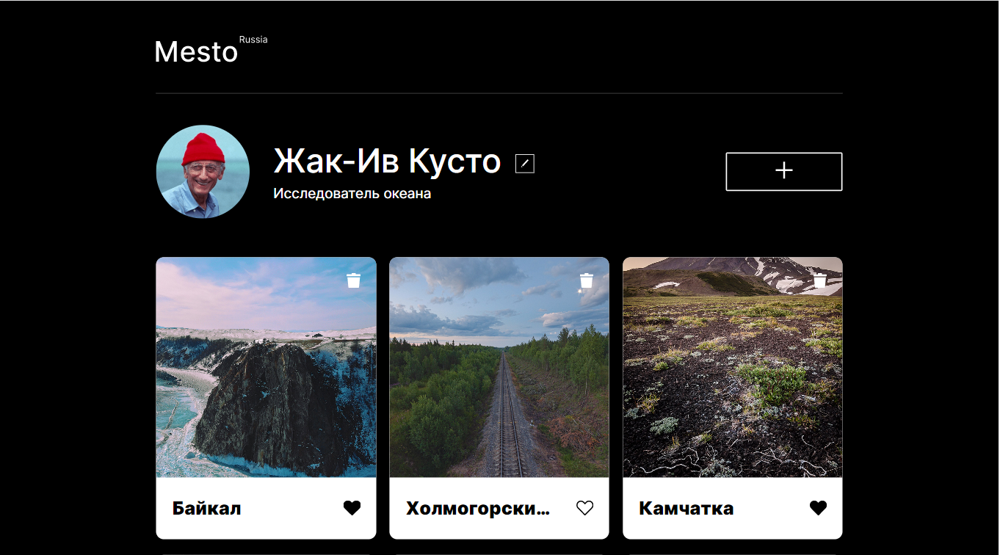

# Проект: Место

### Обзор
* Описание
* Структура с примерами оформления

**Описание**

Ссылка: **(https://Vitaliy23Nikolaenko.github.io/mesto/index.html)**
;

Одностраничный сайт от [**Яндекс.Практикум**](https://practicum.yandex.ru/) с графическим офрмлением, представляющий собой интерактивный сервис со следующими возможностями:
  * редактирование профиля через модальное окно;
  * добавление фотографий из путешествий;
  * проставление реакций.

**Структура с примерами оформления**

Сайт включает в себя следующие **секции**:

**1.** Шапка сайта (**header**) с логотипом.


**2.** Секция **profile** с описанием профиля и возможностью его редактирования через всплывающее модальное окно, а также кнопка для добавления контента страницы через всплывающее модальное окно.


**3.** Секция **places** с публикациями, в которых содержатся фотография локации, название, кнопка реакции(лайк) и кнопка удаления публикации. Реализована возможность просмотра увеличенного изображения из публикации в всплывающем модальном окне.




Применена адаптивная верстка для дисплеев с разрешением от 320px до 1280px.

**320px**

;

**768px**

;

**1024px**

;

**1280px**

;


Проект выполнен с помощью **HTML**,**СSS** и **JavaScript**, 

```
<div class="popup">
        <form class="popup__container">
          <h2 class="popup__title">Редактировать профиль</h2>
          <input type="text" class="popup__edit-title" />
          <input type="text" class="popup__edit-description" />
          <button type="submit" class="popup__submit-button">Сохранить</button>
          <button type="button" class="popup__close-button">
            
          </button>
        </form>
        <div class="popup__overlay"></div>
      </div>
```
```
let formElement = document.querySelector(".popup__container");
let nameInput = formElement.querySelector(".popup__edit-title");
let jobInput = formElement.querySelector(".popup__edit-description");

function OpenPopUp() {
  popUp.classList.add("popup_opened");
  nameInput.value = name.textContent;
  jobInput.value = job.textContent;
}

function ClosePopUp() {
  popUp.classList.remove("popup_opened");
}

openPopUpButton.addEventListener("click", OpenPopUp);
closePopupButton.addEventListener("click", ClosePopUp);
```